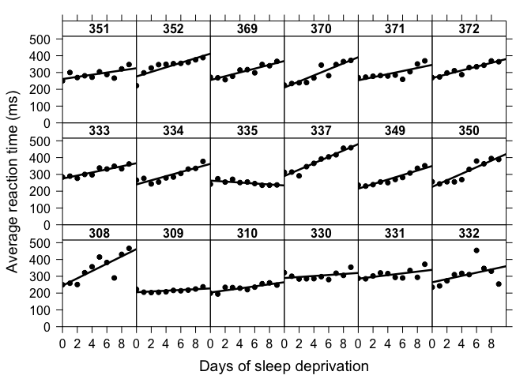

Multilevel/Mixed Effects Model Packages in R
================
Stefan Eng
2021-08-25

## Package choices

-   `lme4`
    -   “Fit linear and generalized linear mixed-effects models.”
-   `nlme`
    -   Linear and Nonlinear Mixed Effects Models
    -   Can specify covariance structure for the residuals
        -   Useful for complex longitudinal modeling
-   `brms`
    -   “Fit Bayesian generalized (non-)linear multivariate multilevel
        models using ‘Stan’ for full Bayesian inference.”
-   `gamm4` (Won’t cover today)
    -   “Generalized Additive Mixed Models using ‘mgcv’ and ‘lme4’”
-   `rstanarm`
    -   Alternative Bayesian generalized (non-)linear multivariate
        multilevel modeling

## lme4::sleepstudy data Belenky et al. (2003)

> “The average reaction time per day for subjects in a sleep deprivation
> study. On day 0 the subjects had their normal amount of sleep.
> Starting that night they were restricted to 3 hours of sleep per
> night. The observations represent the average reaction time on a
> series of tests given each day to each subject.”

-   `Reaction` Average reaction time (ms)
-   `Days` Number of days of sleep deprivation
-   `Subject` Subject number on which the observation was made

## sleepstudy

``` r
sleepstudy.plot <- create.scatterplot(
  Reaction ~ Days | Subject,
  data = sleepstudy,
  type = c('p', 'r'),
  layout = c(6, 3),
  xlab.label = "Days of sleep deprivation",
  ylab.label = "Average reaction time (ms)",
  ylab.cex = 1.2,
  xlab.cex = 1.2,
  xaxis.cex = 1,
  yaxis.cex = 1,
  lwd = 2.5
  )
```

## sleepstudy



## Sleep Study - Model 1

-   Fixed effect for time (Days)
-   Per subject intercept

``` r
# Fit the model using ML
fm1 <- lmer(
  formula = Reaction ~ 1 + Days + (1 | Subject),
  data = sleepstudy,
  REML = FALSE)
# Predict with subject-specific intercepts
sleepstudy$fm1.predict <- predict(fm1)
# Predict average subject
sleepstudy$fm1.predict.marginal <- predict(
  fm1,
  re.form = NA)
```

## Subject Specific Prediction


## REML vs ML

-   Two main ways of fitting a mixed-effect model: REML (Restricted
    Maximum-likelihood) and ML
    -   REML has biased estimates for fixed effects when study is
        unbalanced
    -   ML has biased estimates for variance components
-   In `lme4` use `REML = TRUE` or `REML = FALSE`
-   In `nlme` use `method = "ML"` or `method = "REML"`
-   Use ML if comparing fixed effects or REML if comparing variance
    components
-   Need ML if using likelihood ratio tests (or AIC/BIC)

## Sleep Study - Model 1 REML

``` r
fm1.REML <- lmer(
  formula = Reaction ~ 1 + Days + (1 | Subject),
  data = sleepstudy,
  REML = TRUE)
```

## Sleep Study - Model 1 REML

    ## Linear mixed model fit by REML ['lmerMod']
    ## Formula: Reaction ~ 1 + Days + (1 | Subject)
    ##    Data: sleepstudy
    ## REML criterion at convergence: 1786.465
    ## Random effects:
    ##  Groups   Name        Std.Dev.
    ##  Subject  (Intercept) 37.12   
    ##  Residual             30.99   
    ## Number of obs: 180, groups:  Subject, 18
    ## Fixed Effects:
    ## (Intercept)         Days  
    ##      251.41        10.47

## Extract Information from summary

``` r
# Get variance components
VarCorr(fm1.REML)
```

    ##  Groups   Name        Std.Dev.
    ##  Subject  (Intercept) 37.124  
    ##  Residual             30.991

``` r
# ranef(...) gets the random effects
head(ranef(fm1.REML)$Subject)
```

    ##     (Intercept)
    ## 308   40.783710
    ## 309  -77.849554
    ## 310  -63.108567
    ## 330    4.406442
    ## 331   10.216189
    ## 332    8.221238

## Confidence interval of parameters

``` r
# Get a bootstrapped confidence interval for parameters
confint(fm1.REML, method = "boot")
```

    ##                  2.5 %    97.5 %
    ## .sig01       22.872060  52.68069
    ## .sigma       27.692499  34.55650
    ## (Intercept) 231.988023 270.69282
    ## Days          8.859519  12.04940

## lme4 syntax

-   `(1 | Subject)`
    -   subject specific intercept
-   `(1 + Days | Subject)`
    -   subject specific intercept and slope with Time and Subject
        *correlated*
-   `(1 | Subject) + (0 + Days | Subject)` is the same as
    `(1 + Days || Subject)`
    -   subject specific intercept and slope with Time and Subject
        *independent*
    -   Don’t forget the `0 + Days` or `(Days | Subject)` implicitly
        will fit `(1 + Days | Subject)`

## Nested vs crossed design

-   Nested groups: `(1|group1/group2)` equivalent to
    `(1|group1) + (1|group1:group2)`
    -   This cannot be determined from the data, but needs knowledge of
        the experimental design
-   Crossed design: `(1|group1) + (1|group2)`

## Sleep Study - Model 2 (Subject slopes)

``` r
fm2 <- lmer(
  formula = Reaction ~ 1 + Days + (1 + Days | Subject),
  data = sleepstudy,
  REML = FALSE)
sleepstudy$fm2.predict <- predict(fm2)
```

## Sleep Study - Model 2 (Subject slopes)


## Sleep Study - Plot random effects

``` r
# Lattice dotplot
dotplot(ranef(fm2))
```

## Sleep Study - Plot random effects

    ## $Subject


## Sleep Study - Compare Model 1 and 2

-   Use `anova(fm1, fm2)` for likelihood ratio test
    <table>
    <thead>
    <tr>
    <th style="text-align:left;">
    term
    </th>
    <th style="text-align:right;">
    AIC
    </th>
    <th style="text-align:right;">
    BIC
    </th>
    <th style="text-align:right;">
    logLik
    </th>
    <th style="text-align:right;">
    deviance
    </th>
    <th style="text-align:right;">
    statistic
    </th>
    <th style="text-align:right;">
    df
    </th>
    <th style="text-align:right;">
    p.value
    </th>
    </tr>
    </thead>
    <tbody>
    <tr>
    <td style="text-align:left;">
    fm1
    </td>
    <td style="text-align:right;">
    1802
    </td>
    <td style="text-align:right;">
    1815
    </td>
    <td style="text-align:right;">
    -897
    </td>
    <td style="text-align:right;">
    1794
    </td>
    <td style="text-align:right;">
    NA
    </td>
    <td style="text-align:right;">
    NA
    </td>
    <td style="text-align:right;">
    NA
    </td>
    </tr>
    <tr>
    <td style="text-align:left;">
    fm2
    </td>
    <td style="text-align:right;">
    1764
    </td>
    <td style="text-align:right;">
    1783
    </td>
    <td style="text-align:right;">
    -876
    </td>
    <td style="text-align:right;">
    1752
    </td>
    <td style="text-align:right;">
    42
    </td>
    <td style="text-align:right;">
    2
    </td>
    <td style="text-align:right;">
    7e-10
    </td>
    </tr>
    </tbody>
    </table>

## Sleep Study - Model 3 nlme

``` r
fm3.nlme <- lme(
  fixed = Reaction ~ 1 + Days,
  random = ~ 1 | Subject,
  data = sleepstudy,
  method = "ML")
```

## Sleep Study - Model 3 nlme

``` r
fm3.nlme
```

    ## Linear mixed-effects model fit by maximum likelihood
    ##   Data: sleepstudy 
    ##   Log-likelihood: -897.0393
    ##   Fixed: Reaction ~ 1 + Days 
    ## (Intercept)        Days 
    ##   251.40510    10.46729 
    ## 
    ## Random effects:
    ##  Formula: ~1 | Subject
    ##         (Intercept) Residual
    ## StdDev:    36.01208 30.89543
    ## 
    ## Number of Observations: 180
    ## Number of Groups: 18

## Residual error structure

-   One benefit of using `nlme` is that we can specify error correlation
    structure
-   Using `lme4` we are constrain by the fact that
    **ϵ** ∼ *N*(0, *σ**I*)
-   With `nlme` we can model **ϵ** ∼ *N*(0, *R*), where *R* can be
    specified.

## Sleep Study - Model 4 nlme with AR(1) errors

-   Assume that
    *ϵ*<sub>*t*</sub> = *φ**ϵ*<sub>*t* − 1</sub> + *δ*<sub>*t*</sub>,
    where *δ*<sub>*t*</sub> has zero mean and constant variance.
-   Including `correlation=corAR1(form = ~ 1 | Subject)` estimates *φ*.

``` r
fm4.nlme <- lme(
  fixed = Reaction ~ 1 + Days,
  random = ~ 1 | Subject,
  correlation=corAR1(form = ~ 1 | Subject),
  data = sleepstudy,
  method = "ML")
```

## Sleep Study - Model 4 nlme with AR(1) errors

    ## Linear mixed-effects model fit by maximum likelihood
    ##   Data: sleepstudy 
    ##   Log-likelihood: -872.415
    ##   Fixed: Reaction ~ 1 + Days 
    ## (Intercept)        Days 
    ##   252.78857    10.46688 
    ## 
    ## Random effects:
    ##  Formula: ~1 | Subject
    ##         (Intercept) Residual
    ## StdDev:    30.82052 36.98125
    ## 
    ## Correlation Structure: AR(1)
    ##  Formula: ~1 | Subject 
    ##  Parameter estimate(s):
    ##      Phi 
    ## 0.641424 
    ## Number of Observations: 180
    ## Number of Groups: 18

## Sleep Study - Compare model 3 and 4

<table>
<thead>
<tr>
<th style="text-align:left;">
</th>
<th style="text-align:right;">
Model
</th>
<th style="text-align:right;">
df
</th>
<th style="text-align:right;">
AIC
</th>
<th style="text-align:right;">
BIC
</th>
<th style="text-align:right;">
logLik
</th>
<th style="text-align:left;">
Test
</th>
<th style="text-align:right;">
L.Ratio
</th>
<th style="text-align:right;">
p-value
</th>
</tr>
</thead>
<tbody>
<tr>
<td style="text-align:left;">
fm3.nlme
</td>
<td style="text-align:right;">
1
</td>
<td style="text-align:right;">
4
</td>
<td style="text-align:right;">
1802
</td>
<td style="text-align:right;">
1815
</td>
<td style="text-align:right;">
-897
</td>
<td style="text-align:left;">
</td>
<td style="text-align:right;">
NA
</td>
<td style="text-align:right;">
NA
</td>
</tr>
<tr>
<td style="text-align:left;">
fm4.nlme
</td>
<td style="text-align:right;">
2
</td>
<td style="text-align:right;">
5
</td>
<td style="text-align:right;">
1755
</td>
<td style="text-align:right;">
1771
</td>
<td style="text-align:right;">
-872
</td>
<td style="text-align:left;">
1 vs 2
</td>
<td style="text-align:right;">
49.2
</td>
<td style="text-align:right;">
2.255e-12
</td>
</tr>
</tbody>
</table>

## brms/rstanarm

-   Full hierarchical treatment of linear mixed model
    -   No need to fit differently (ML/REML) for mixed models
-   Ability to specify priors
-   `brms` compiles model to Stan code but is more flexible
-   `rstanarm` does not need compiling for lm/glm models which make it
    quicker to develop

## brms and Statistical Rethinking

-   Someone recreated all of the examples from the book Statistical
    Rethinking to `brms`:
    <https://bookdown.org/ajkurz/Statistical_Rethinking_recoded/>

-   Great introduction to `brms` even if you have not read the book

## Generalized Linear Mixed Models

-   Both `lme4` and `brms` support generalized models via the
    `family = "..."` argument
-   Negative binomial not supported directly with `brms`
-   NB available in `rstanarm::stan_glm::stan_glmer.nb` or
    `lme4::glmer.nb`

## rstanarm example

``` r
rsa.mod1 <- rstanarm::stan_glmer(
  Reaction ~ 1 + Days + (1 | Subject),
  data = sleepstudy, chains = 1)
```

    ## 
    ## SAMPLING FOR MODEL 'continuous' NOW (CHAIN 1).
    ## Chain 1: 
    ## Chain 1: Gradient evaluation took 0.000109 seconds
    ## Chain 1: 1000 transitions using 10 leapfrog steps per transition would take 1.09 seconds.
    ## Chain 1: Adjust your expectations accordingly!
    ## Chain 1: 
    ## Chain 1: 
    ## Chain 1: Iteration:    1 / 2000 [  0%]  (Warmup)
    ## Chain 1: Iteration:  200 / 2000 [ 10%]  (Warmup)
    ## Chain 1: Iteration:  400 / 2000 [ 20%]  (Warmup)
    ## Chain 1: Iteration:  600 / 2000 [ 30%]  (Warmup)
    ## Chain 1: Iteration:  800 / 2000 [ 40%]  (Warmup)
    ## Chain 1: Iteration: 1000 / 2000 [ 50%]  (Warmup)
    ## Chain 1: Iteration: 1001 / 2000 [ 50%]  (Sampling)
    ## Chain 1: Iteration: 1200 / 2000 [ 60%]  (Sampling)
    ## Chain 1: Iteration: 1400 / 2000 [ 70%]  (Sampling)
    ## Chain 1: Iteration: 1600 / 2000 [ 80%]  (Sampling)
    ## Chain 1: Iteration: 1800 / 2000 [ 90%]  (Sampling)
    ## Chain 1: Iteration: 2000 / 2000 [100%]  (Sampling)
    ## Chain 1: 
    ## Chain 1:  Elapsed Time: 0.656549 seconds (Warm-up)
    ## Chain 1:                0.363216 seconds (Sampling)
    ## Chain 1:                1.01977 seconds (Total)
    ## Chain 1:

## rstanarm priors

    ## Priors for model 'rsa.mod1' 
    ## ------
    ## Intercept (after predictors centered)
    ##   Specified prior:
    ##     ~ normal(location = 299, scale = 2.5)
    ##   Adjusted prior:
    ##     ~ normal(location = 299, scale = 141)
    ## 
    ## Coefficients
    ##   Specified prior:
    ##     ~ normal(location = 0, scale = 2.5)
    ##   Adjusted prior:
    ##     ~ normal(location = 0, scale = 49)
    ## 
    ## Auxiliary (sigma)
    ##   Specified prior:
    ##     ~ exponential(rate = 1)
    ##   Adjusted prior:
    ##     ~ exponential(rate = 0.018)
    ## 
    ## Covariance
    ##  ~ decov(reg. = 1, conc. = 1, shape = 1, scale = 1)
    ## ------
    ## See help('prior_summary.stanreg') for more details

## rstanarm model

    ## 
    ## Model Info:
    ##  function:     stan_glmer
    ##  family:       gaussian [identity]
    ##  formula:      Reaction ~ 1 + Days + (1 | Subject)
    ##  algorithm:    sampling
    ##  sample:       1000 (posterior sample size)
    ##  priors:       see help('prior_summary')
    ##  observations: 180
    ##  groups:       Subject (18)
    ## 
    ## Estimates:
    ##                                          mean   sd     10%    50%    90% 
    ## (Intercept)                             250.3   10.5  237.0  250.4  263.4
    ## Days                                     10.5    0.8    9.5   10.4   11.5
    ## b[(Intercept) Subject:308]               42.2   13.3   25.5   42.0   59.2
    ## b[(Intercept) Subject:309]              -76.5   13.4  -94.3  -76.1  -59.8
    ## b[(Intercept) Subject:310]              -61.8   13.6  -79.1  -62.2  -44.8
    ## b[(Intercept) Subject:330]                5.7   13.3  -10.7    5.2   23.3
    ## b[(Intercept) Subject:331]               11.5   13.2   -5.4   11.9   27.9
    ## b[(Intercept) Subject:332]                9.2   13.6   -8.0    9.3   26.2
    ## b[(Intercept) Subject:333]               17.3   13.7    0.1   16.8   35.0
    ## b[(Intercept) Subject:334]               -1.8   13.0  -18.4   -1.7   15.8
    ## b[(Intercept) Subject:335]              -44.4   13.1  -60.9  -44.1  -28.1
    ## b[(Intercept) Subject:337]               73.1   13.4   55.4   72.9   90.2
    ## b[(Intercept) Subject:349]              -20.1   13.4  -36.4  -20.2   -2.5
    ## b[(Intercept) Subject:350]               15.2   13.1   -2.3   15.3   32.1
    ## b[(Intercept) Subject:351]               -7.1   13.6  -24.6   -7.2   10.6
    ## b[(Intercept) Subject:352]               37.4   13.1   20.7   37.0   54.8
    ## b[(Intercept) Subject:369]                8.1   13.1   -9.4    8.0   25.3
    ## b[(Intercept) Subject:370]               -5.2   13.6  -23.2   -5.3   12.2
    ## b[(Intercept) Subject:371]               -2.5   12.9  -18.1   -2.6   13.6
    ## b[(Intercept) Subject:372]               19.4   12.8    3.4   18.7   36.5
    ## sigma                                    31.1    1.8   28.9   31.0   33.6
    ## Sigma[Subject:(Intercept),(Intercept)] 1529.7  574.1  887.7 1408.8 2304.5
    ## 
    ## Fit Diagnostics:
    ##            mean   sd    10%   50%   90%
    ## mean_PPD 298.5    3.3 294.1 298.6 302.6
    ## 
    ## The mean_ppd is the sample average posterior predictive distribution of the outcome variable (for details see help('summary.stanreg')).
    ## 
    ## MCMC diagnostics
    ##                                        mcse Rhat n_eff
    ## (Intercept)                             0.8  1.0  182 
    ## Days                                    0.0  1.0  781 
    ## b[(Intercept) Subject:308]              0.8  1.0  276 
    ## b[(Intercept) Subject:309]              0.8  1.0  293 
    ## b[(Intercept) Subject:310]              0.8  1.0  307 
    ## b[(Intercept) Subject:330]              0.8  1.0  309 
    ## b[(Intercept) Subject:331]              0.8  1.0  301 
    ## b[(Intercept) Subject:332]              0.8  1.0  274 
    ## b[(Intercept) Subject:333]              0.8  1.0  315 
    ## b[(Intercept) Subject:334]              0.8  1.0  292 
    ## b[(Intercept) Subject:335]              0.8  1.0  290 
    ## b[(Intercept) Subject:337]              0.8  1.0  267 
    ## b[(Intercept) Subject:349]              0.8  1.0  263 
    ## b[(Intercept) Subject:350]              0.8  1.0  261 
    ## b[(Intercept) Subject:351]              0.8  1.0  270 
    ## b[(Intercept) Subject:352]              0.9  1.0  234 
    ## b[(Intercept) Subject:369]              0.8  1.0  290 
    ## b[(Intercept) Subject:370]              0.9  1.0  232 
    ## b[(Intercept) Subject:371]              0.8  1.0  296 
    ## b[(Intercept) Subject:372]              0.8  1.0  286 
    ## sigma                                   0.1  1.0  695 
    ## Sigma[Subject:(Intercept),(Intercept)] 39.0  1.0  217 
    ## mean_PPD                                0.1  1.0 1016 
    ## log-posterior                           0.3  1.0  235 
    ## 
    ## For each parameter, mcse is Monte Carlo standard error, n_eff is a crude measure of effective sample size, and Rhat is the potential scale reduction factor on split chains (at convergence Rhat=1).

## Summary

-   Many options for (generalized) linear mixed modeling in R
